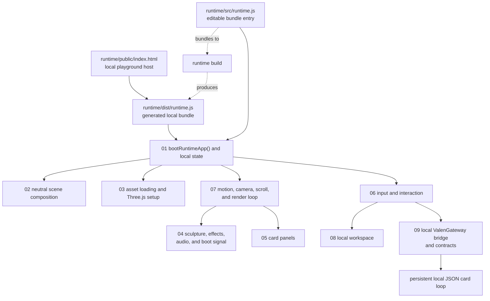

# Public Runtime Call Order

This is a navigation guide, not a promise that the browser executes every file
in one straight line. Core branches after boot. Use the numbered module buckets
to find the smallest owner for a feature or bug.

## Local Playground Path

## First Files To Read

1. `../runtime/public/index.html`
2. `../runtime/src/runtime.js`
3. `../runtime/src/boot-runtime-app/boot-runtime-app.js`
4. `../runtime/src/boot-runtime-app/start-runtime-renderer.js`
5. `../runtime/src/boot-runtime-app/install-valen-runtime-global.js`

After those five, follow the numbered bucket that owns the change. Do not read
the generated `../runtime/dist/runtime.js` top to bottom first.
